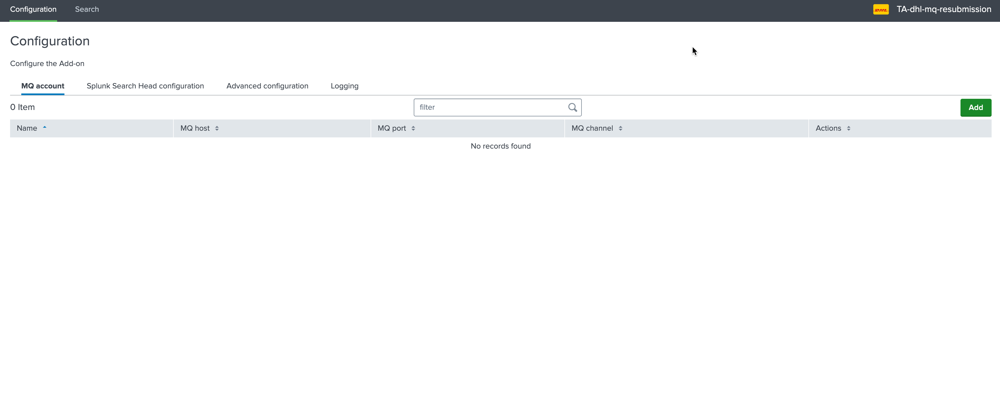
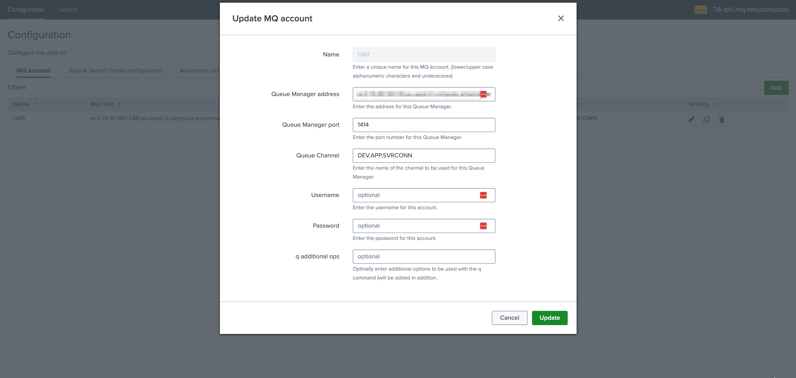
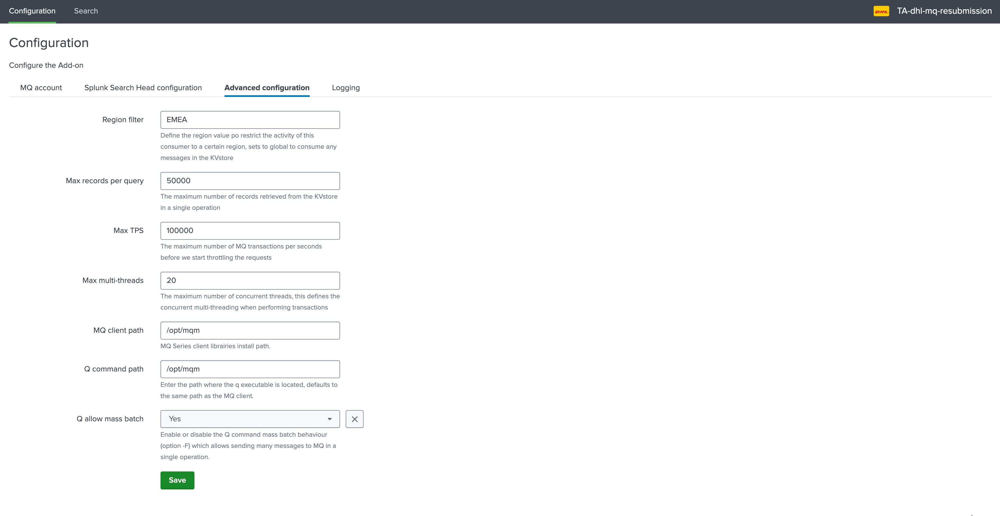

MQ configuration
----------------

**The configuration of the MQ resubmission can be summarised as following:**

- The Queue managers are created on the Heavy Forwarder consumer nodes as part of an account configuration
- The account is then referenced as the target when submitting messages to be submitted through MQ

Configuration of an MQ manager account
======================================

**On the Heavy Forwarder, access to the configuration UI:**

*Add a new account, the following information are required:**

.. list-table::
   :header-rows: 1

   * - Item
     - Description
   * - **Name**
     - This is the account identifier which will be used when submitting messages for resubmission purposes, this should match the real name of the Queue Manager
   * - **Queue Manager address**
     - The Queue Manager network address
   * - **Queue Manager port**
     - The Queue Manager network port
   * - **Queue Channel**
     - The Queue Manager channel to be used
   * - **Username**
     - The username if using authentication to access MQ
   * - **Password**
     - The password if using authentication to access MQ
   * - **q additional ops**
     - Optional additional arguments to be added to the q command when messages are published to this Queue Manager

The same MQ Manager can be configured on multiple Heavy Forwarders consumers from the same HA group.

However, the same MQ Manager name cannot be used more than once on a given Heavy Forwarder consumer.

Advanced configuration
======================

**The advanced configuration provides additional options that can be defined on a per consumer basis:**

.. list-table::
   :header-rows: 1

   * - Item
     - Description
   * - **Region filter**
     - Define the region value po restrict the activity of this consumer to a certain region, sets to global to consume any messages in the KVstore
   * - **Max records per query**
     - The maximum number of records retrieved from the KVstore in a single operation
   * - **Max TPS**
     - The maximum number of MQ transactions per seconds before we start throttling the requests
   * - **Max multi-threads**
     - The maximum number of concurrent threads, this defines the concurrent multithreading when performing transactions
   * - **MQ client path**
     - MQSeries client libraries install path.
   * - **Q command path**
     - Enter the path where the q executable is located, defaulting to the same path as the MQ client.
   * - **Q allow mass batch**
     - Enable or disable the Q command mass batch behaviour (option -F) which allows sending many messages to MQ in a single operation.
