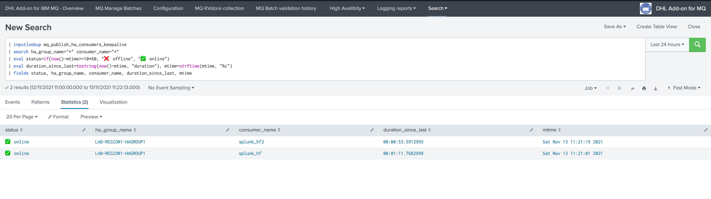

High Availability
#################

Introduction
============

**The DHL resubmission solutions supports High Availability as follows:**

- Multiple Heavy Forwarders can be members of a same **HA group**
- The **HA group** is a an identifier configurable in the ``TA-dhl-resubmission-ha-client`` configuration UI
- Every consumer sends **keep alive Metadata** to the SHC layer on a regular basis hitting a REST API endpoint hosted by the application ``dhl-resubmission``, keep alive Metadata are stored in a KVstore
- The SHC performs a **manager election per HA group** on a regular basis recycling these keep alive Metadata, by HA group a manager gets elected depending on the conditions
- Every consumer retrieves and **caches the HA groups election Metadata**, and stores in a local KVstore collection
- When the consumer sees messages pending from being processed, it verifies which member is the **manager for its HA group** using the local manager cache information
- If it is the manager for its group, messages are processed, otherwise the consumer remains inactive and does not process the messages
- When a manager is detected as **offline** based on how long we didn't get a keep alive, any other online member from the group gets elected
- If there no **online member** active in the HA group, there is no manager elected and we cannot consume messages any longer until at least one member is online again
- The whole process can take up to **5/10 minutes in case of an outage** on the manager consumer during which we are not going to consume messages
- However, the process is **fully automated and transparent**, maximum 10 minutes after the outage happens on the manager, we start consuming using any of the online members

Configuration
=============

**The configuration stands on the consumer (Heavy Forwarder), define an HA group for the consuming pool:**

.. image:: img/ha_group1.png
   :alt: ha_group1.png
   :align: center
   :width: 1200px
   :class: with-border

**The HA group can be:**

- A string identifier of your choice, but using a meanful naming convention is recommended
- The HA group should ideally describe the scope and purpose of the consumer, such as the application scopes and regions
- This is especially true as the Add-on provides analytic and alerting on High Availability, so the HA group is a metadata information allowing you to understand the context

The HA group is the only configuration required, the whole process is fully automated and there are no interactions required either.

**A few minutes after the HA group was configured, the High Availability overview dashboards shows the HA group and members statuses:**

.. image:: img/ha_group2.png
   :alt: ha_group2.png
   :align: center
   :width: 1000px
   :class: with-border

Keep alive from consumers
=========================

**Every 5 minutes, consumers send Keep Alive Metadata to the SHC using a bearer token based authentication and target defined in the configuration UI of the consumers:**

.. image:: img/ha_group3.png
   :alt: ha_group3.png
   :align: center
   :width: 1000px
   :class: with-border

The scheduled report ``DHL resubmission HA group - send keepalive consumer`` calls the following command on the Heavy Forwarders:

::

   | sendkeepalive

This custom commands hits a REST API endpoint on the Search Head tier, similar to:

::

      url = f'https://{remote_host}:{remote_port}/services/resubmission/send_keepalive'
      data = {
            'ha_group_name': ha_group,
            'consumer_name': socket.gethostname(),
      }

The activity from the Heavy Forwarder perspective is logged in:

::

   /opt/splunk/var/log/splunk/dhl_resubmision_sendkeepalive.log

Heavy Forwarders will index these logs into the _internal index automatically:

::

   index=_internal sourcetype=dhl_resubmission:commands:dhl_resubmision_sendkeepalive

On the receiver side (Search Head tier)
=======================================

The receiver side of the keep alive sent by Heavy Forwarders is the Search Head tier hosting the ``dhl_resubmission`` application.

The keep alive activity is logged to:

::

   /opt/splunk/var/log/splunk/resubmission_ha_rest_api.log

And indexed automatically into the Splunk _internal index, the following search will show activity related to the keep alive calls performed by the clients:

::

   index=_internal sourcetype=dhl:resubmission_ha:rest post_send_keepalive

*Example of activity traces:*

::

   2023-09-04 08:28:01,703 INFO resubmission_ha_rest_handler.py post_send_keepalive 203 keepalive, updating record key=95b317f7ce7d377bda777f4b76d132a5, ha_group_name=hagrp001, consumer_name=hf1, collection=kv_resubmission_ha_consumers_keepalive   

Keep alive statuses are stored in a KVstore on the Search Head tier:

Manager per HA group election on the SHC
========================================

**Every 5 minutes, the Search Head tier verifies the statuses of keep alive records and performs the election of a manager in each group, this is handled by the following scheduled report:**

- DHL resubmission HA group - manager group election

Heavy Forwarders consumers manager HA group verification
========================================================

When a consumer starts a task on the Heavy Forwarders, it first verifies the status of the HA group it is a member of.

It performs this task by hitting a REST API endpoint hosted in the ``dhl_resubmission`` application:

::

   /services/resubmission_client/get_manager

The Search Head tier response provides the name of the manager for the group, the consumers then verifies its own identity and takes a decision based on this statement:

Single node run
---------------

If the application ``TA-dhl-resubmission-ha-client`` was installed but not configured (the HA group was left at its default), then the Heavy Forwarder is running in single node mode, and consuming messages will always be granted.

**Consumers will log a message similar to:**

::

   context="high-availability", this consumer is running in single node mode, messages consumption will be granted

Elected manager
---------------

**If the Heavy Forwarder node is currently the elected manager, the consumer will log:**

::

   2023-09-04 08:44:08,247 INFO submithttp.py generate 522 worker_id=2, context="high-availability", this consumer is the elected manager for this group, messages consumption will be granted, ha_group_name="hagrp001", myhostname="hf1", ha_group_elected_manager="hf1", ha_registered_consumers="hf1,hf2"   

Passive node
------------

**If the Heavy Forwarder node is not currently the elected manager, the consumer will log:**

::

   2023-09-04 09:03:06,676 INFO submithttp.py generate 525 worker_id=4, context="high-availability", this consumer is not currently the elected manager for this group, messages consumption will not be granted, ha_group_name="hagrp001", myhostname="hf2", ha_group_elected_manager="hf1", ha_registered_consumers="hf1,hf2"

When the active manager goes offline
====================================

**When the current manager goes offline for any reason, for instance:**

- Splunk service is stopped or not operating properly on the consumer for more than 5 minutes
- It cannot send Keep alive Metadata any longer to the SHC (network issues, authentication issues, etc)
- A configuration issues on the consumer prevents the normal Keep alive execution (application was uninstalled, reports disabled etc)

**The issue is detected within the next 5/10 minutes maximum and another member from the HA group gets elected:**

.. image:: img/ha_group8.png
   :alt: ha_group8.png
   :align: center
   :width: 1000px
   :class: with-border

- During the time of the manager outage detection which can take up to 10 minutes, we are not consuming messages for the HA group any longer
- Any pending batch which was approved remains pending until we have at least one online consumer in the HA group
- When a new manager gets elected, messages start to be processed transparently using the new manager for the group
- When the issue is fixed on the previously elected manager, and it is detected again, the member remains a passive member as long as the current manager remains online

**When the member that suffered from an outage is back online, the High Availability dashboard shows its status is back in the pool, the member becomes a valid election candidate again:**

- If for some reason, a given consumer cannot access to the SHC any longer, its own status is unknown and it will no longer process messages until the service is back again

The whole process is entirely automated, from the discovery of the HA groups to the management of the HA group managers, no intervention is required at any point in time for the consuming process to be highly available on multiple Splunk Heavy Forwarders.

Troubleshooting
===============

REST API endpoints logs on the Search Head tier
-----------------------------------------------

**Logs are indexed in the _internal index, and can be accessed through the following search:**

::

   index=_internal sourcetype=dhl:resubmission_ha:rest 

**On the file-system, logs are written to:**

::

   /opt/splunk/var/log/splunk/resubmission_ha_rest_api.log

Consumers related logs
^^^^^^^^^^^^^^^^^^^^^^

send keep alive traces
----------------------

**Consumers log keep alive traces can be searched by:**

::

   index=_internal sourcetype=dhl_resubmission:commands:dhl_resubmision_sendkeepalive

**On the file-system, logs are written to:**

::

   /opt/splunk/var/log/splunk/dhl_resubmision_sendkeepalive.log

consumers node verification traces
----------------------------------

The manager node verification traces will be logged in the consumer main logs of the workers:

*MQ:*

**In Splunk:**

::

   index=gbs_its_pds_infra_mqsubmission sourcetype="dhl_mq_resubmission:commands:submitmq"

**On the file-system:**

::

   /opt/splunk/var/log/splunk/dhl_mq_resubmision_submitmq.log

*SOAP:*

**In Splunk:**

::

   index=gbs_its_pds_infra_httpsubmission sourcetype="dhl_http_resubmission:commands:submithttp"

**On the file-system:**

::

   /opt/splunk/var/log/splunk/dhl_http_resubmision_submithttp.log
