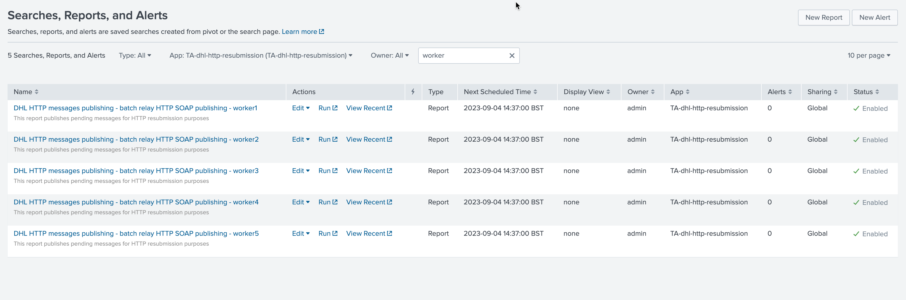
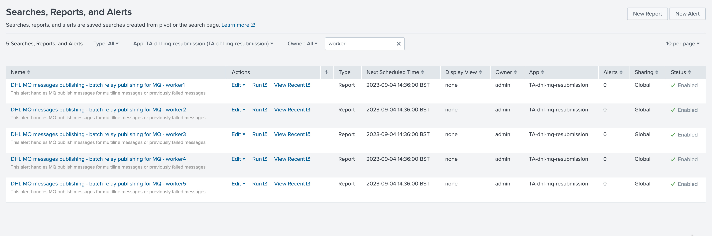
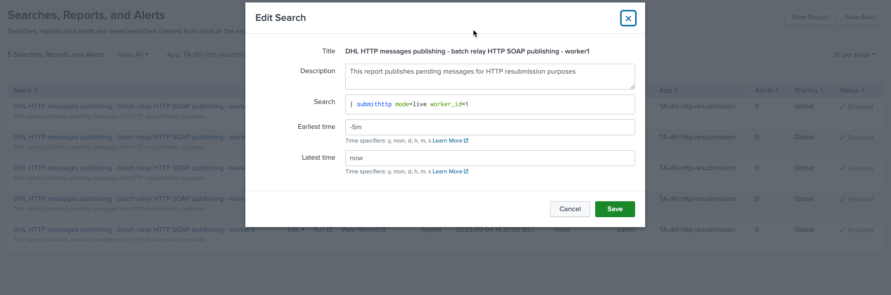
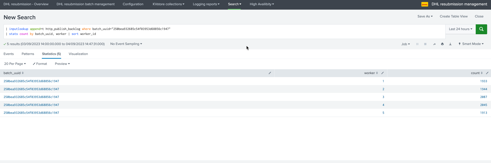
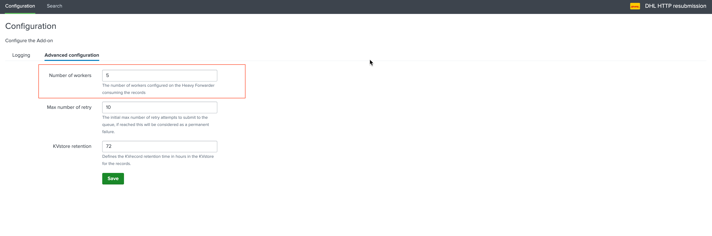
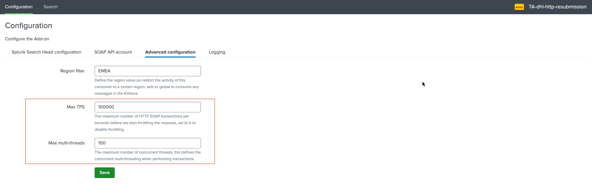
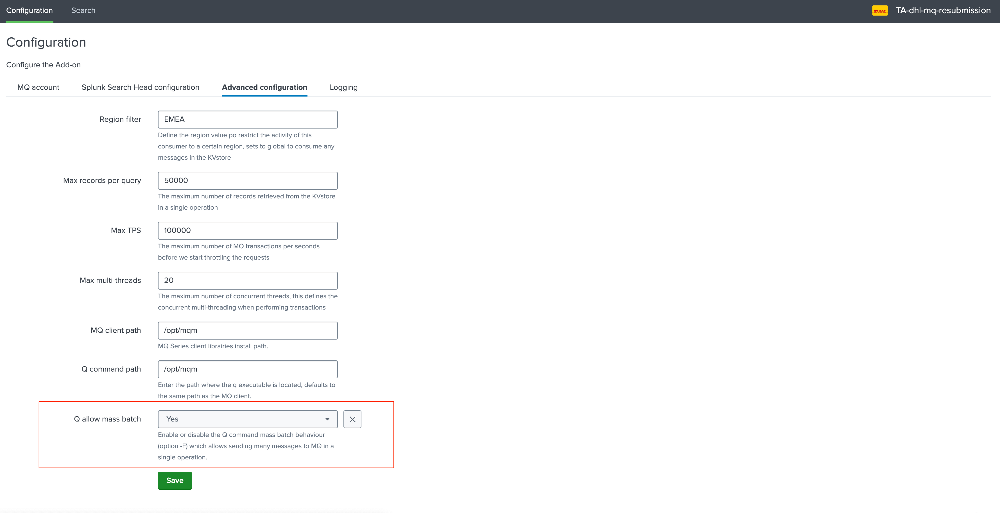
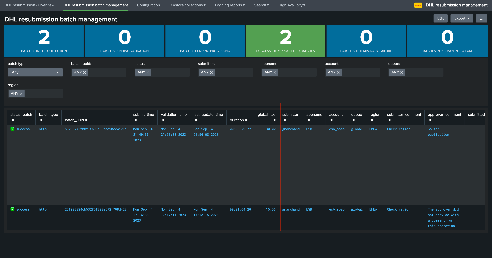

High Scale Volume
#################

**The DHL resubmission solution provides scaling at large volume of messages using different techniques:**

- Multiple worker processes on the Heavy Forwarders
- Multithreading at the Python level when processing messages to their destination
- Batch processing for MQ single line messages

**Also, the user interfaces realy on a metadata view of the backlog KVstore collections for a very fast user experience:**

- When submitting messages for reprocessing, the messages are stored in a KVstore collection on the Search Head Tier (one collection for HTTP, one for MQ)
- When dealing with large number of messages, the time needed to operate on the status of the batches would become extremely high and would slightly impact the user experience
- Therefore, the backend automatically reflect the batches definition into a Metadata KVstore collection, which is what user deal with instead of the whole backlog collections

**Finally, the manage batch UI provide quick access to the performance counters, allowing users to easily review the amount of time required to process a batch effectively.**

Multiple worker processes
=========================

For each processing Add-on ``TA-dhl-http-resubmission`` and ``TA-dhl-mq-resubmission``, 5 workers processes are configured by default.

**These are translated into a scheduled report per application and worker:**

*For SOAP:*

*For MQ:*

Each worker is in fact an instance of the backend with its schedule and specifying a worker identifier, example:

.. hint::

    - Worker instances are scheduled to run every minute such that any pending processes start as soon as possible and in parrallel.
    - When the worker process starts, it will verify and load any messages associated with its own worker identifier.
    - When batch of messages are submitted by users, the solution automatically split the messages 

*For instance, in the following example a batch of approximately 10k messages has been submitted to SOAP, looking at the worker_id KVstore field, we can observe the split between the different workers:*

*Search example for SOAP:*

::

    | inputlookup append=t http_publish_backlog where batch_uuid="*"
    | stats count by batch_uuid, worker | sort worker_id 

Using this technique, each worker processes its messages independently which slightly optimize the capabilities of fast consuming messages.

Configuration of the number of workers on the frontend application
------------------------------------------------------------------

The number of workers to be used when splitting the messages at the submission phase is configured at the level of the Search Head tier, in the ``dhl_http_resubmission`` and ``dhl_mq_resubmission`` applications:

.. hint::

    - This number needs to match the number of worker processes configured and enaled on the consumer side in the associated ``TA_dhl_http_resubmission`` and ``TA_dhl_mq_resubmission`` Addons
    - Shall we want to decrease the number of workers, update this value and disable the associate workers on the consummers
    - On the opposite, shall we want to increase the number of workers, new workers can be created by cloning the report from an existing worker, updating the search and finally updating the number of workers configured
    - If for any reasons, the number of workers configured in this screen does not match the number of enabled workers, messages associated with non existing or enabled workers will not be consummed

Worker processes in the logs
----------------------------

When a consumer worker process messages, logs will automatically associate the operation with the worker identifier processing the messages, example:

::

    2023-09-04 15:00:06,907 INFO submithttp.py generate 493 submithttp is starting, worker_id=5

Multi-threading
===============

Python backend processing messages are designed to perform these tasks in parrallel using multi-threading, the level of multi-threading is controllable by two options worker together:

- Max TPS
- Max Multi-Threads

You can fine tune these settings to increase or lower the volume of messages which are being sent in parrallel, increasing these values will eventually increase the back pressure we may impose to the SOAP or MQ backends.

MQ Batch processing for single line messages
============================================

For MQ particularly, and if all messages from a batch are single line messages, the default approach is to leverage the ``q`` command capabilities to process messages in batch.

In this case, and this is the default behaviour, messages are stored in a single file and sent as part of a batch send request using the q command argument ``-F``.

This behaviour can be enabled or disabled on the consumer sides in the ``TA_dhl_mq_resubmission`` Add-on:

Metadata KVstore collections for a fast user experience
=======================================================

**To optimize the user experience and avoid hitting issues with large volume of messages, the resubmission solution implements a logic of Metadata KVstore, therefore for each application we have in fact two types of KVstore collections:**

*For SOAP:*

- http_publish_backlog
- http_publish_metadata

*For MQ:*

- mq_publish_backlog
- mq_publish_metadata

When messages are submitted for reprocessing, the message including its payload are stored in the KVstore, at large scale this can lead to multi-millions of records temporarily stored in the KVstore collections.

To avoid dealing directly with the large backlog collection from the user perspective, the solution instead relies on a Metadata view of the batches stored in very tiny KVstore collections, while it could take a while to update large volume of messages, it will take a millisecond to update a single Metadata record.

**The loading logic of the Manage batch UI for instance calls the following macro:**

::

    | `get_table_batches`

**Which is defined as:**

::

    [get_table_batches]
    definition = inputlookup append=t mq_publish_metadata | inputlookup append=t http_publish_metadata | eval key=_key\
    | foreach account queue region [ eval <<FIELD>>=if(isnull('<<FIELD>>'), "global", '<<FIELD>>') ]\
    | `eval_status_batch`\
    | sort - limit=0 submit_time\
    | eval duration=if(isnotnull(last_update_time), round(last_update_time-validation_time, 2), "N/A")\
    | eval global_tps=if(isnotnull(duration), round(batch_submitted_count/duration, 2), "N/A")\
    | eval duration=if(isnum(duration), tostring(duration, "duration"), duration)\
    | foreach submit_time, validation_time, last_update_time [ eval <<FIELD>> = strftime('<<FIELD>>', "%c") ]\
    | join type=outer batch_uuid [ search `idx_resubmission` (sourcetype="dhl_mq_resubmission:commands:submitmq" OR sourcetype=dhl_http_resubmission:commands:submithttp) CASE(ERROR) earliest=-7d latest=now | rex "batch_uuid=(?<batch_uuid>\w+)" | stats latest(_raw) as last_error by batch_uuid ]
    iseval = 0    

Performance and duration counters
=================================

The solution handles different time related Metadata information, which are provided as part of the Manage Batch user interface and allows to easily review the time required for the processing of the batches:

