User guide
##########

Submitting messages to SOAP and MQ-Series
=========================================

**In brief:**

Submitting messages for reprocessing works as follows:

- A search is performed in Splunk which provides the message payloads and unique session identifiers
- Additional logic is added to the search to perform any needed action, such as filtering or deduping
- A Splunk command is called to submit these messages to be reprocessed through SOAP HTTPs, or MQ-Series
- This generates a unique batch which associates submitted messages, this batch is submitted in a transilient "pending" state
- An approver manages the batch status, actions can be to validate, cancel or delete the batch
- Once validated, messages will start to be processed as soon as possible
- The reprocessing solutions handles the life cycle of the messages, if a message has been successfully submitted, its status is updated until all messages are successfully processed

Sending messages to the SOAP API with puthttprelay
--------------------------------------------------

Usage
^^^^^

The command ``puthttprelay`` is a streaming command used to submit messages to be reprocessed through to the SOAP API over HTTPs.

The following arguments are available:

.. list-table::
   :header-rows: 1

   * - Argument
     - Description
     - Default
     - Mandatory
   * - region
     - The region value, if unspecified, defaults to global.
     - global
     - No
   * - field_appname
     - field name containing the app for the resubmission.
     - app
     - No
   * - field_account
     - field name containing the account for the resubmission.
     - account
     - No
   * - field_service_name
     - field name containing service_name for the resubmission.
     - service_name
     - No
   * - field_soap_action
     - field name containing soap_action for the resubmission.
     - soap_action
     - No
   * - field_message_id
     - field name containing the message identifier to be published.
     - message_id
     - No
   * - field_message
     - field name containing the message to be published.
     - message
     - No
   * - dedup
     - uses a hash-based logic to prevent inserting records already known to the KVstore and avoid generating duplicates. If true, the hash used for the records is based on the message identifier and the raw message, the same hash cannot be added more than once. If false, use a random record for the key generation.
     - True
     - No
   * - comment
     - comment message for auditing purposes.
     - (No default value provided)
     - Yes

Example
^^^^^^^

**For instance, the following search submit a batch of messages to SOAP:**

::

   index=esb_cert sourcetype=json ServiceName="ShipmentManagement.ShipmentManifestConsumer_v4" SessionId="*" | head 100
   | rex field=_raw "(?ms)ArchiveData\":\"(?<message>.+)\"}" 
   | eval message=replace(replace(message,"[\n\r\f]"," "),"\s{2,}"," ") 
   | stats values(message) as message by SessionId

   | eval appname="ESB", account="esb_soap", service_name="ShipmentManagement.ShipmentManifestConsumer_v4", soap_action="DhlTest"
   | puthttprelay field_appname="appname" field_account="account" field_soap_action="soap_action" field_message_id="SessionId" field_message="message" comment="Demo SOAP" dedup=False   

**This results in:**

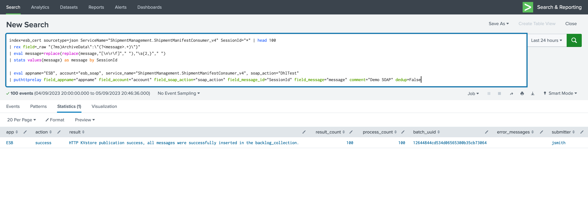

**A batch of messages appear now as pending:**

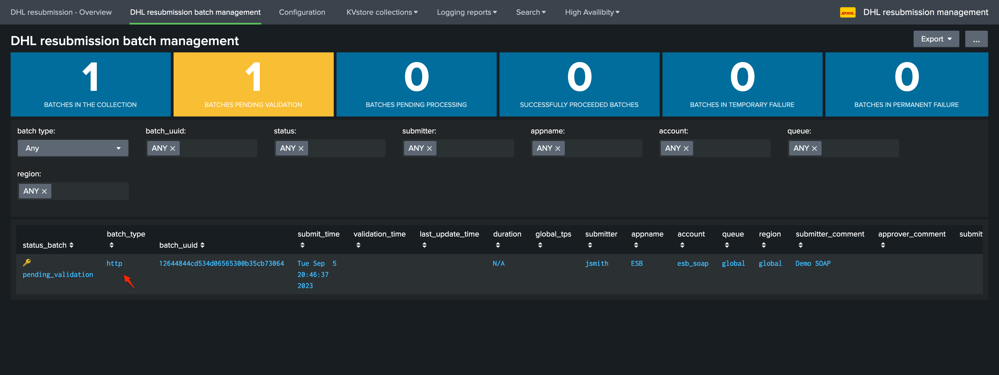

**Once validated, messages consumption start as soon as possible, and when processed the batch status is updated as well as various information related to the processing phase:**

*Note the "http" type of batch for SOAP*

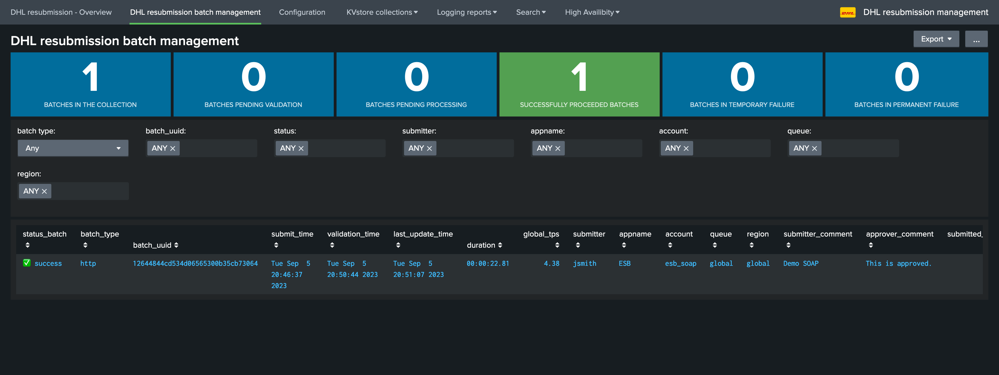

**The overview dashboard also provides various information and shortcut accesses to processing logs:**

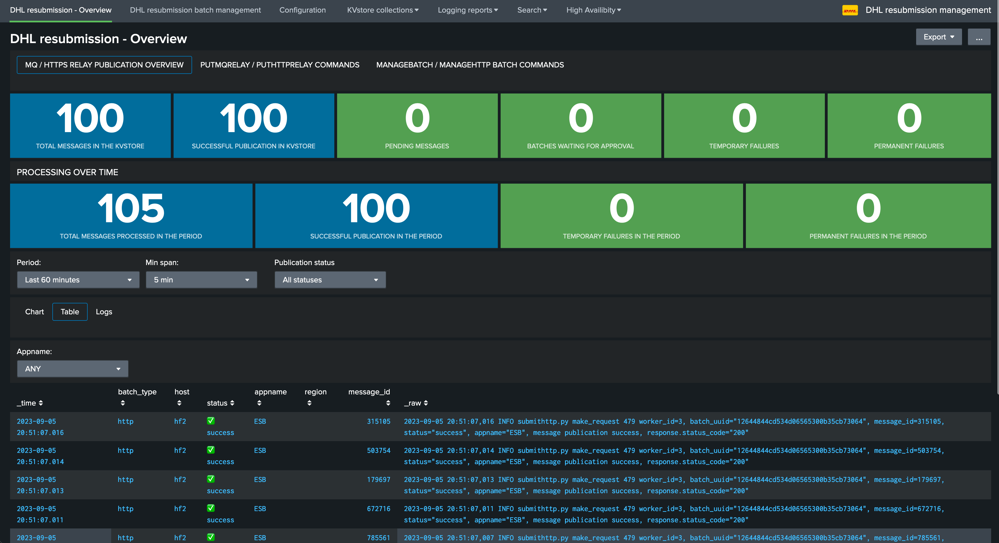

**You can also easily access to the Metadata KVstore collection:**

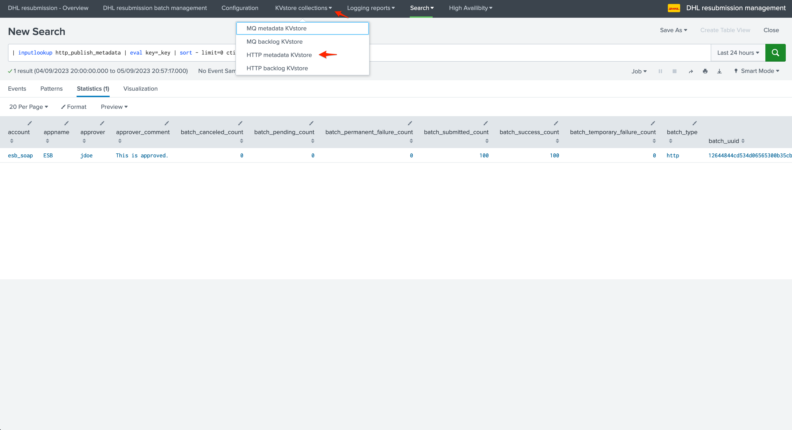

**The Backlog KVstore contains the message payloads and the status for each message, in the caase of SOAP it also contains the detailed HTTP response from the API:**

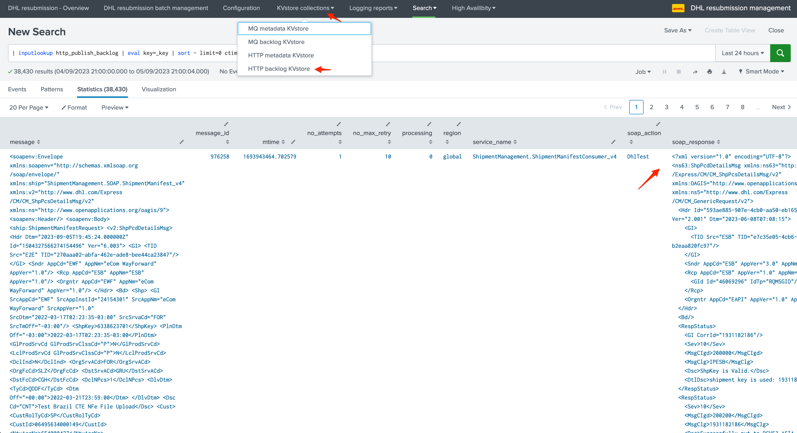

SOAP response controls
^^^^^^^^^^^^^^^^^^^^^^

**In the context of sending messages to the SOAP API, the resubmission backend verifies several conditions to determine if a message was processed successfully:**

HTTP Response code
''''''''''''''''''

The backend expect a successful HTTP code to be returned by the SOAP API, which means the SOAP API should return a 2** HTTP code such as 200 for the processing to be successful.

The HTTP return code is carefully logged and reviewed, as well as made available in the various dashboards:

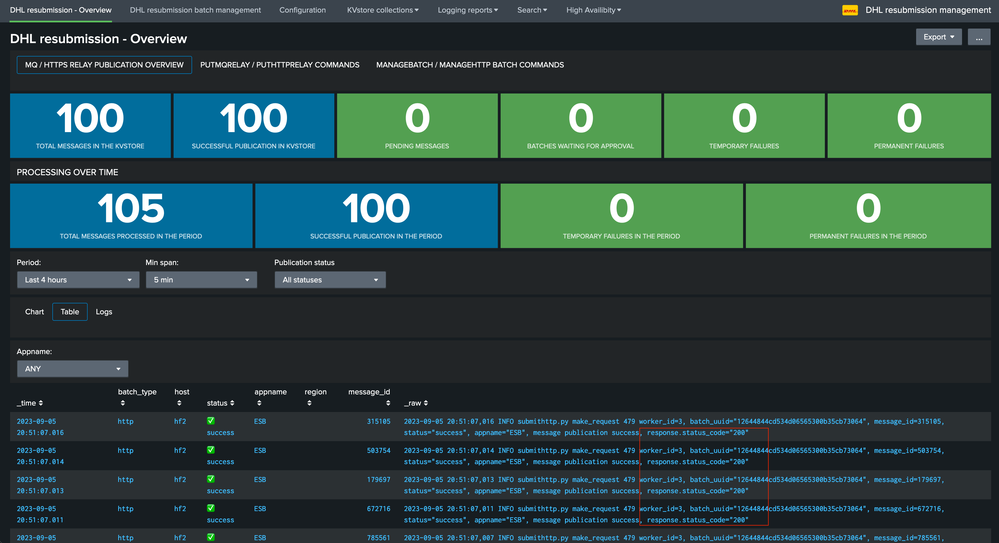

SOAP Fault
''''''''''

A SOAP Fault is an error in the SOAP protocol layer when using web services based on SOAP. SOAP (Simple Object Access Protocol) is a protocol for exchanging structured information in the implementation of web services in computer networks.

A SOAP fault indicates that there's a problem that needs to be addressed in the SOAP message, often before the application layer gets involved. The fault can happen due to various reasons, such as:

- The message was malformed.
- A mandatory information item wasn't provided.
- The server had a problem processing the message.
- There was a network-level error.

Here's a breakdown of the fault structure:

- Fault Code: A code that provides more information about the fault.
- Fault String: A human-readable explanation of the fault.
- Fault Actor: The piece of the software that spotted the fault.
- Detail: Specific application error information related to the Body element of the fault message.

The backend first checks if the string "SOAP-ENV:Fault" exists in the response content. 

If it does, that means a SOAP Fault has been encountered.

If a SOAP fault is detected, the code then tries to extract the faultstring (a human-readable description of the fault) from the SOAP message.

*Here's a basic example of a SOAP fault:*

::

   <SOAP-ENV:Envelope 
      xmlns:SOAP-ENV="http://schemas.xmlsoap.org/soap/envelope/">
      <SOAP-ENV:Body>
         <SOAP-ENV:Fault>
               <faultcode>SOAP-ENV:Server</faultcode>
               <faultstring>Server Error</faultstring>
               <detail>
                  <e:myfaultdetails xmlns:e="Some-URI">
                     Application specific error details.
                  </e:myfaultdetails>
               </detail>
         </SOAP-ENV:Fault>
      </SOAP-ENV:Body>
   </SOAP-ENV:Envelope>

SOAP Response pattern
'''''''''''''''''''''

Finally, an optional application level verification can be added to the builtin KVstore collection ``http_resubmission_soap_action`` in the field ``soap_response_control`` field.

**The pattern can be:**

- An explicit pattern that should be found **at least once** in the SOAP response
- A regular expression that should be matched **at least once** in the SOAP response

**Example:**

::

   | inputlookup http_resubmission_soap_action

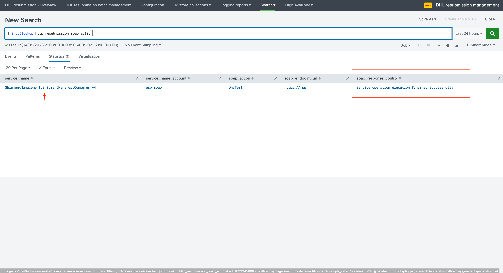

In this example, when the SOAP service is ``ShipmentManagement.ShipmentManifestConsumer_v4``, we expect that a successfully processed message by the SOAP API should result in a response containing at least an occurrence of the sentence ``Service operation execution finished successfully``.

If this is the case, the message is then considered as successful, otherwise it will be considered as a failure and will enter the life cycle of automated re-attempts. (temporary failure)

Note that the functional SOAP response control is depending on the value of the soap_service, the KVstore collection is processed automatically to lookup for an entry for the SOAP service, if found the SOAP functional control is performed automatically.

**SOAP Functional failure example:**

If the SOAP functional control fails for any reason, these information are logged and shown in the overview dashboard:

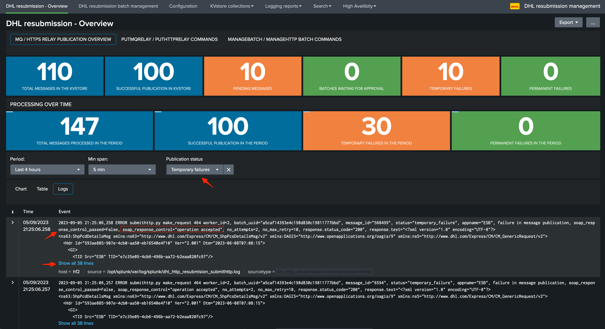

After the maximal number of attempts is reached, and if the issue is not addressed, the message will reach the permanent failure status and its publication will be cancelled.

Sending messages to the MQSeries with putmqrelay
------------------------------------------------

Usage
^^^^^

The command ``putmqrelay`` is a streaming command used to submit messages to be reprocessed through MQSeries.

The following arguments are available:

.. list-table::
   :header-rows: 1

   * - Argument
     - Description
     - Default
     - Mandatory
   * - region
     - The region value, if unspecified, defaults to global.
     - global
     - No
   * - field_appname
     - Field name containing the app for the resubmission.
     - app
     - No
   * - field_account
     - Field name containing the account for the resubmission.
     - account
     - No
   * - field_queue
     - Field name containing the queue for the resubmission.
     - queue
     - No
   * - field_message_id
     - Field name containing the message identifier to be published.
     - message_id
     - No
   * - field_message
     - Field name containing the message to be published.
     - message
     - No
   * - dedup
     - Uses a hash-based logic to prevent inserting records already known to the KVstore and avoid generating duplicates. If true, the hash used for the records is based on the message identifier and the raw message, the same hash cannot be added more than once. If false, use a random record for the key generation.
     - True
     - No
   * - comment
     - Comment message for auditing purposes.
     - (No default value provided)
     - Yes

Example
^^^^^^^

**For instance, the following search submit a batch of messages to MQ:**

::

   index=esb_cert sourcetype=json ServiceName="ShipmentManagement.ShipmentManifestConsumer_v4" SessionId="*" | head 100
   | rex field=_raw "(?ms)ArchiveData\":\"(?<message>.+)\"}" 
   | eval message=replace(replace(message,"[\n\r\f]"," "),"\s{2,}"," ") 
   | stats values(message) as message by SessionId

   | eval appname="ESB", account="QM1", queue="DEMO"
   | putmqrelay field_appname="appname" field_account="account" field_queue="queue" field_message_id="SessionId" field_message="message" comment="Demo MQ" dedup=False

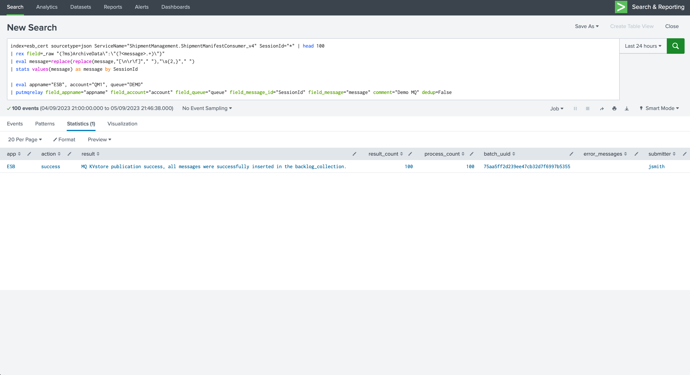

**This results in:**

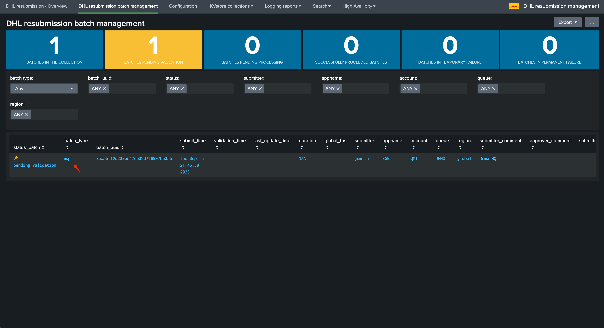

Note the "MQ" type of batch.

**The process is then similar, the MQ response is part of the protocol and will be handled automatically to validate the success of the operation:**

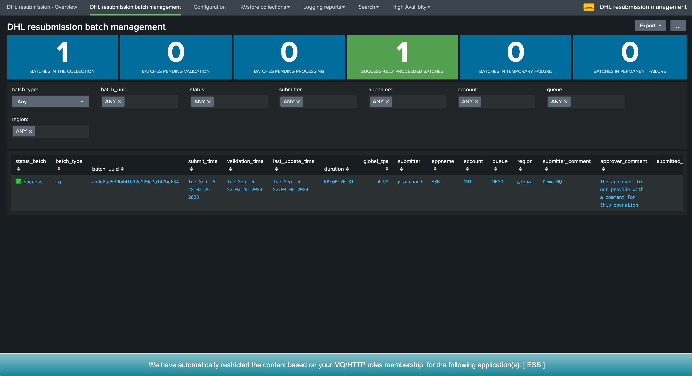

**For instance, in case of failures, the log will show the response from MQ:**

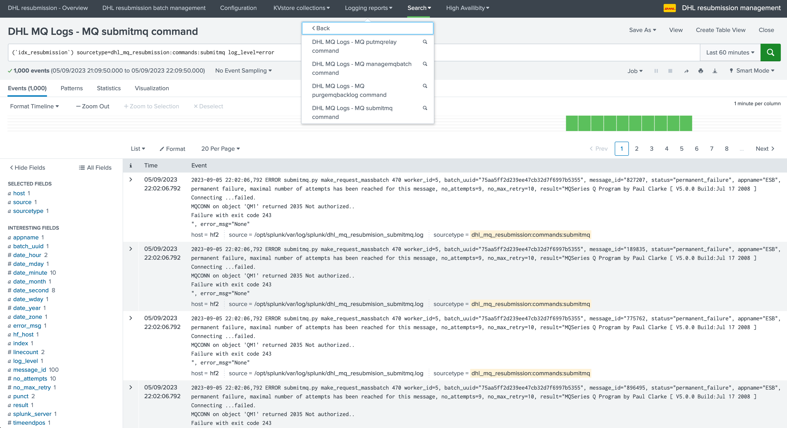

Message publication life cycle and automated re-attempts
========================================================

**The resubmission workflow automatically handles the life cycle of the message using the following workflow:**

- Once a batch is validated, message start to be processed as soon as possible
- If the publication is successful, the message status is updated accordingly as ``success``
- If the publication was fails, the message enter the loop of automated retried and is set as ``temporary_failure``
- If the number of attempts reaches the maximal amount of attempts, the message publication is cancelled and the status is set as ``permanent_failure``

**The maximal number of attempts is configured in the dhl_http_rsubmission and dhl_mq_resubmission applications:**

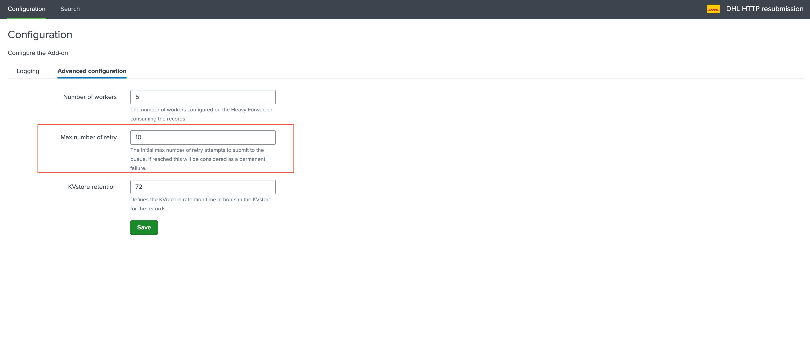

**Finally, all messages whatever the status are purged from the collections after a certain amount of time:**

